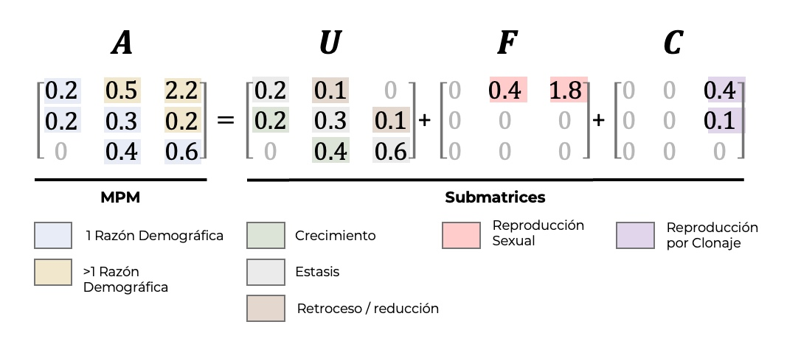

# Matrices de transicion, fecundidad y clonal 

## Por: Raymond 


## Tres tipos de matrices

Para facilitar los analisis y interpretaciones es necesario tener claro la diferencias en los parámetros que provienen de transiciones, fecundidades y clonaje, cada submatriz se suma para tener un modelo de una matriz poblacional.  La suma de cada una de esas sub-matrices resulta en la matriz de transiciones para evaluar algunos de los parametros del crecimiento poblacional.

Definiciones de las matrices

 - MatU = Matriz de transiciones
 - MatF = Matriz de Fecundidad
 - MatC = Matriz de clonaje
 - MatA = MatU + MatF + MatC
 
 
  {width=90%}

## MatU: Matriz de transiciones

En la matriz de transiciones, **MatU** se encuentra solamente la información sobre de transiciones, estasis o retroceso entre las etapas de vida. Por consecuencia todo información sobre reproducción y clonaje es excluida.  Si el diseño del modelo asume tres etapas de vida, plantulas, juvenil y adultos, se incluye solamente las siguientes transiciones.

Nota que es este modelo los juveniles no pueden regresar a ser plantulas, pero los adultos pudiese regresar a ser juvenil.  Seria probablemente más adecuado re-nombrar la etapa juvenil (que se entiende que no es reproductivo) a algo más claro como "Individuos pequeño".

```{r}
library(DiagrammeR)
library(Rage)
matU <- rbind(
  c(0.1, 0.0, 0.0),
  c(0.5, 0.3, 0.05),
  c(0.001, 0.4, 0.8)
)
stages <- c("Plantulas", "Juvenil", "Adulto")
plot_life_cycle(matU, stages=stages)
```


## MatF: Matriz de fecundidad

 Si uno sigue la figura anterior vemos que los individuos en la segunda etapa se reproducen sexualmente (producen plantulas). Por consequencia seria probablemente más adecuado cambiar de nombre para la segunda etapa de "juvenil" a "individuos pequeños".  Lo que se observa es el ciclo de vida de la oportaciones de plantulas es que los Individuos pequeños y Grande producen plantulas.  
 
 
```{r}
library(DiagrammeR)
library(Rage)
matF <- rbind(
  c(0.0, 0.4, 1.8),
  c(0.0, 0.0, 0.0),
  c(0.0, 0.0, 0.0)
)
stages <- c("Plantulas", "Ind Pequeños", "Ind Grande")
plot_life_cycle(matF, stages=stages)
```

 
## MatC = Matriz de clonación

Esa matriz representa la información para especies que se reproducen por clonaje.  Nota que este necesario lo que se define por clonaje. Por ejemplo un individuo de Epidendrum que crece y que tenga más tallos, no debería ser considerado clonaje, pero crecimiento del individuo. Al contrario un individuo que crece de forma que la planta madre se separa en dos o más partes donde no comparten connección pudiese ser considerado clonaje.  Otra alternativa es que hay muchas especies de orquideas que producen keiki, el momento que estos se separan de la madre se puden considerar como un individuo a parte.  

Se deberia enfatizar que añadir el concepto de clonaje dentro de la matriz de transiones resulta en estimados de parametros diferentes, tal como el tamaño efectivo de población, Ne, en adición de evaluar otros conceptos evolutivos.  En estudios evolutivos no es el individuo como tal que es la unidad de interes pero el individuo como fuente de diversidad genética, por consecuencia individuos (clones) que son geneticamente igual son evolutivamente el mismo individuos aunque esten seperado fisicamente. Las poblaciones organizados en clones affecta la interpretacion de datos tanto en los estudios ecologico y evolutivos @cook1983clonal.  Cuando se estudia especies con clonación hay que diferenciar entre los que es el "ramet" y un "genet".  Los genet son la suma de todas las partes "ramet" que tiene la misma genetica.   Los "ramet", son las partes de individuales.  En orquídea se podría considerar cada seudobulbo como un ramet y la suma de todos los seudobulbo como el "genet".  Hay acercamiento para tomar en cuenta la adequación de los "individuos" en la matriz y por consequencia intergrar el concepto de clonación en los estimados. vea: @mcgraw1996estimation.    


